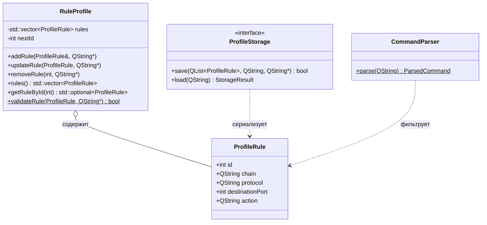

# Схема классов (UML)

```mermaid
classDiagram
    class ProfileRule {
        +int id
        +QString chain
        +QString protocol
        +int destinationPort
        +QString action
    }

    class RuleProfile {
        -std::vector~ProfileRule~ rules
        -int nextId
        +addRule(ProfileRule&, QString*)
        +updateRule(ProfileRule, QString*)
        +removeRule(int, QString*)
        +rules() std::vector~ProfileRule~
        +getRuleById(int) std::optional~ProfileRule~
        +validateRule(ProfileRule, QString*)$ bool
    }

    class ProfileStorage {
        <<interface>>
        +save(QList~ProfileRule~, QString, QString*) bool
        +load(QString) StorageResult
    }

    class CommandParser {
        +parse(QString)$ ParsedCommand
    }

    RuleProfile o-- ProfileRule : содержит
    ProfileStorage ..> ProfileRule : сериализует
    CommandParser ..> ProfileRule : фильтрует
```